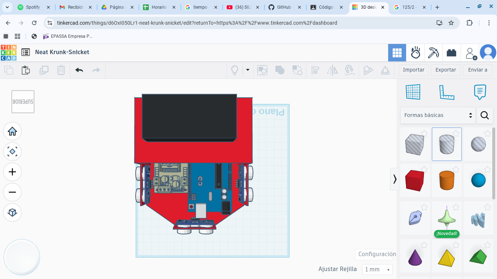
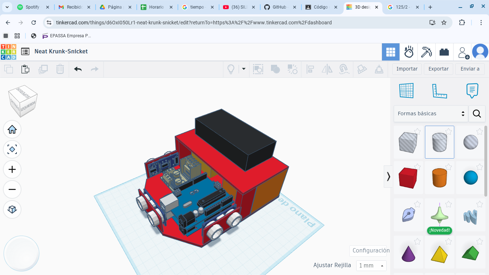
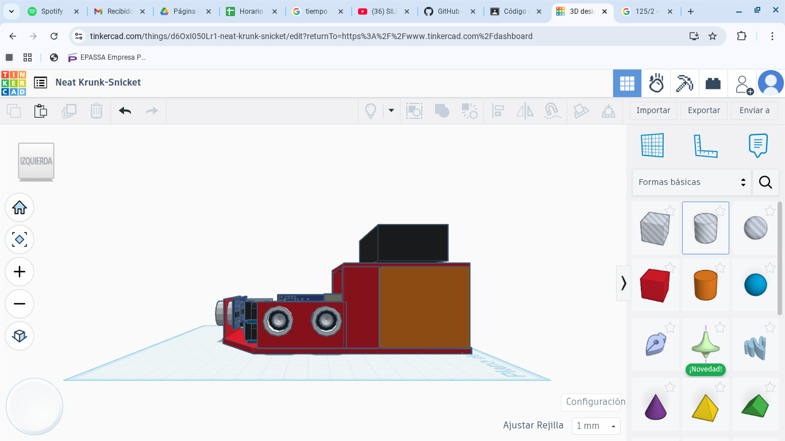
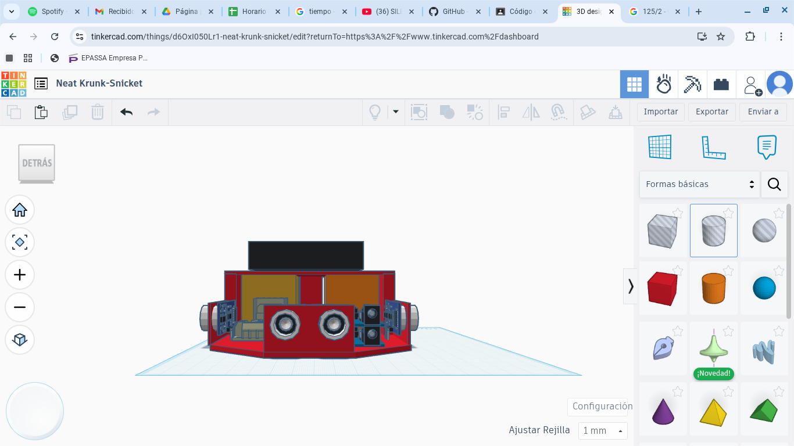
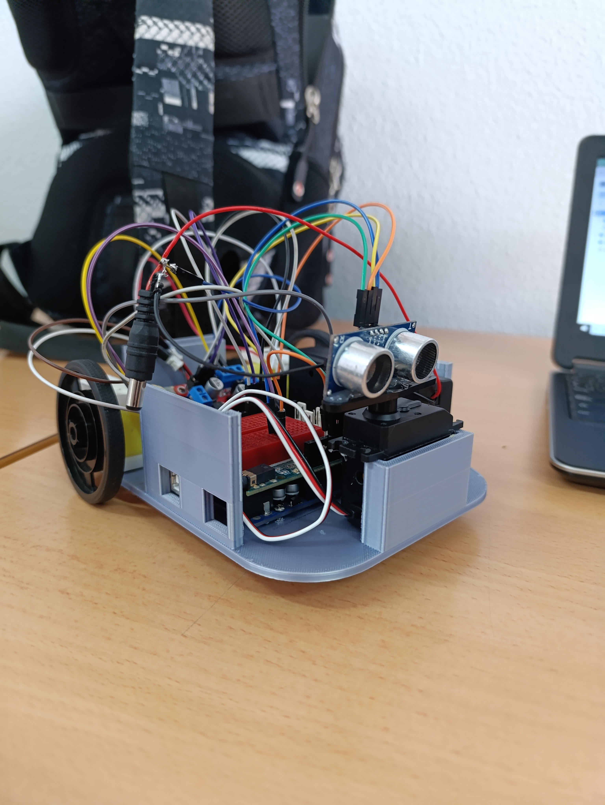

# Future Inginers

Es una categoría de la Olimpiada Mundial de Robótica donde se construye y programa un coche que sigue un carril con sensores ECO para recorrer un circuito sin control humano durante la prueba.

## Diseño 3D del chasis del robot

|  |  |
|  ---                                                     |  ---  |
| |  |

## Chasis del Robot final

Necesitamos organizar el espacio para que pueda entrar:

-2 Motores de corriento continua con reductoras

-1 escudo

-1 seromotor

-1 ultrasonido 

-1 portapilas con pilas de 18650 de 3,7 voltios cada una

-1 placa de arduinos

## Montaje de sensores y cableado

|  |  |
|  ---                                                     |  ---  |

