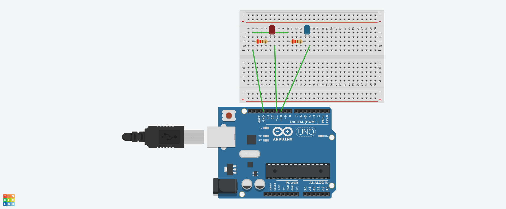
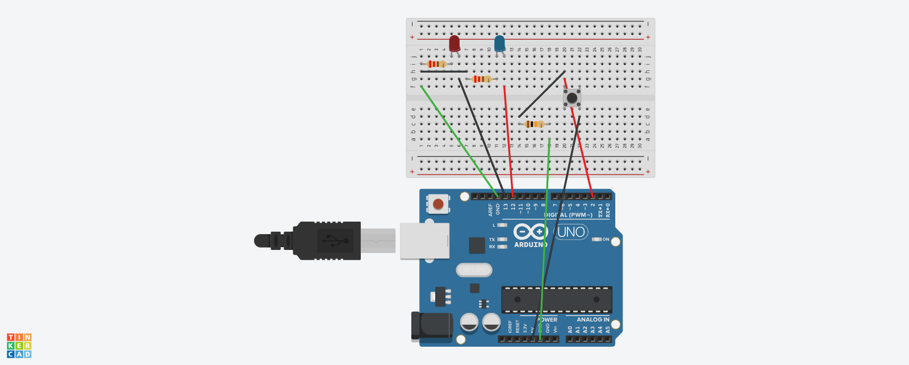
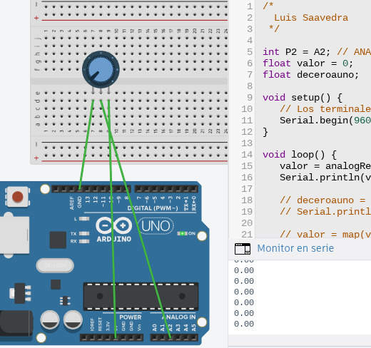

# Robótica 2025/202
Este es cuaderno de robótica de 4 ESO, curso 2025-2026


## Proyecto 1: Arduino doble intermitente

Al iniciarlo los leds parpadean en intermitencia, primero uno ,luego el otro; pero  la maxima velocidad que percibe el ojo humano.

### -Placa arduino y protoboard:

<p align="center">

</p>

He utilizado lo puertos 11 y 10, el 11 para el rojo y el 10 para el azul, los dos estan conectados al GND para proporcioar corriente. El GND se conecta al ánodo del LED y el cátodo a los pines 11 y 10 (el rojo al 11 y el azul al 10), poniendo delante de los LED unas resistencias de 220 omios

### -Codigo:

```
/*
  Luis javier Saavedra Guerrero
  
*/


#define terminal12 12 // Al terminal 12 lo llamamos terminal12
#define terminal13 13 // Al terminal 13 lo llamamos terminal13

// En el setup establecemos los parámetros iniciales.
void setup() {
  // Los terminales pueden ser de entrada INPUT o de salidas OUTPUT
  // En este caso serán de salidas.
  // Fíjate que las líneas terminan en punto y coma;
  pinMode(10, OUTPUT);
  pinMode(11, OUTPUT);
}

int retardo=60;

// Esto es un loop, un lazo o bucle.
// Lo que hay dentro de loop ser repite continuamente, es decir hace las líneas de su interior y
// luego vuelve a realizarlas.
void loop() {
  digitalWrite(10, HIGH);   // El terminal12 en ALTO, es decir a 5 V
  digitalWrite(11, LOW);    // El terminal13 en BAJO, es decir a 0 V
  Serial.println("Parpadeo");
  delay(retardo);              // Retardo
  digitalWrite(10, LOW);    // El terminal12 en BAJO, es decir a 0 V
  digitalWrite(11, HIGH);   // El terminal13 en ALTO, es decir a 5 V
  Serial.println("Intermitente");
  delay(retardo);              // Retardo
}
```

__Explicacion del codigo:__

#define terminal12 12 // Al terminal 12 lo llamamos terminal12

#define terminal13 13 // Al terminal 13 lo llamamos terminal13

## Proyecto 2: Pulsador

Al pulsar el pulsador, un led que siempre estara encendido se apagara y el otro que siempre esta pagado se encendera

### -Placa arduino y protoboard:

<p align="center">

</p>

### -Codigo:


```
/*
  Luis javier Saavedra Guerrero
  
*/

// Entrada y Salida.
// Al pulsar el pulsador se enciende el LED, al dejar de pulsarlo, se apaga.

#define pin2 2   // Al terminal  2 lo llamamos pin2. Aquí irá el pulsador.
#define pin13 13 // Al terminal 13 lo llamamos pin13. Aquí irá el LED.
#define pin12 12
int valor2; // Esto es una variable entera


// En el setup establecemos los parámetros iniciales.
void setup() {
  pinMode(pin2, INPUT);     // El pin2 será entrada. Pulsador.
  pinMode(pin13, OUTPUT);   // El pin13 será salida. LED.
  pinMode(pin12, OUTPUT);
  Serial.begin(9600);        // Para ver información en el Seria Monitor.
}


void loop() {
  valor2 = digitalRead(pin2); // Lee el valor del pin2 y se lo asigna a valor2. (Puede ser 0 o 1)
if (valor2 == HIGH) { 
    digitalWrite(pin13, HIGH); // Si valor2 es ALTO, pone el pin13 en ALTO
    digitalWrite(pin12, LOW);
    Serial.println("Pulsado");
} 

if (valor2 == LOW) { 
    digitalWrite(pin13, LOW); // Si valor2 es BAJO, pone el pin13 en BAJO
    digitalWrite(pin12, HIGH);
    Serial.println("No Pulsado");
} 
}

```


##5.-Potenciómetro.Mapeo monitor serie

Con el potenciómetro podemos obtener 1024 niveles distintos que podemos variar girandolo

###-placa arduino y protoboar

<p align="center">

</p>
<p align="center">

</p>
<p align="center">

</p>


Para introducir valores del 0 al 1023 tenemos que usar las entradas analógicas, en este caso la A2, mientras tanto conectamos los otros 2 a los 5V y al GND para proporcionar energía.

En el monitor en serie podemos ver la intensidad en la que hemos puesto el potenciómetro.


###-Codigo

```
/*
  Luis Saavedra
 */
 
int P2 = A2; // ANALOG IN: A2, va al terminal intermedio del potenciómetro.
float valor = 0;
float deceroauno;
 
void setup() {
   // Los terminales ANALOG IN no hay que configurarlos porque siempre son de entrada.
   Serial.begin(9600);
}
 
void loop() {
   valor = analogRead(P2);
   Serial.println(valor);
   
   // deceroauno = valor / 1023;
   // Serial.println(deceroauno);
   
   // valor = map(valor, 0, 1023, 48, 2468);
   // Serial.println(valor);
   
   delay(20);
}
```

##6.-PWD

###-placa arduino y protoboar
<p align="center">

</p>

<p align="center">

</p>
